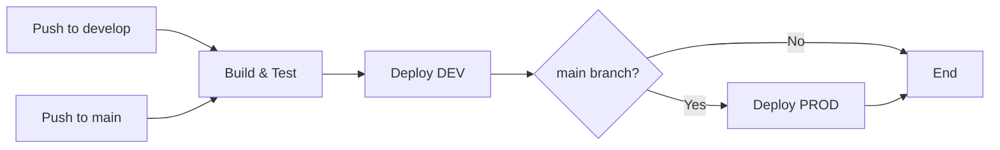

# SesiInfo-Barretos

Azure Functions em .NET 9 com deployment automático usando GitHub Actions e Terraform.

## 📋 Requisitos Atendidos

- ✅ Projeto .NET C# versão 9
- ✅ Azure Functions com HTTP triggers (REST API)
- ✅ Testes automatizados para validar a aplicação
- ✅ CI/CD com GitHub Actions
- ✅ Deploy em ambiente DEV e PROD
- ✅ Deployment em Azure Function App
- ✅ Infraestrutura como Código (IaC) com Terraform

## 🏗️ Arquitetura

```
SesiInfo-Barretos/
├── src/
│   └── SesiInfo.Api/               # Azure Functions .NET 9
│       ├── Functions/
│       │   └── ItemFunctions.cs    # HTTP-triggered functions
│       └── Models/
│           └── Item.cs             # Data model
├── tests/
│   └── SesiInfo.Api.Tests/         # Unit tests
├── terraform/                       # Infrastructure as Code
│   ├── main.tf
│   ├── variables.tf
│   ├── outputs.tf
│   ├── resources.tf
│   ├── dev.tfvars.example
│   └── prod.tfvars.example
└── .github/workflows/
    └── ci-cd.yml                   # Pipeline CI/CD
```

## 🚀 Azure Functions Endpoints

### Health Check
- `GET /health` - Verifica a saúde da API

### Items (CRUD completo)
- `GET /api/items` - Lista todos os items
- `GET /api/items/{id}` - Busca item por ID
- `POST /api/items` - Cria novo item
- `PUT /api/items/{id}` - Atualiza item existente
- `DELETE /api/items/{id}` - Remove item

## 🛠️ Tecnologias Utilizadas

- **.NET 9.0** - Framework principal
- **Azure Functions** - Serverless computing
- **xUnit** - Framework de testes
- **GitHub Actions** - CI/CD
- **Terraform** - Infrastructure as Code
- **Azure Function App** - Hosting da aplicação
- **Azure Application Insights** - Monitoramento

## 📦 Pré-requisitos

- [.NET 9.0 SDK](https://dotnet.microsoft.com/download/dotnet/9.0)
- [Azure Functions Core Tools](https://docs.microsoft.com/azure/azure-functions/functions-run-local)
- [Terraform](https://www.terraform.io/downloads) (>= 1.0)
- Conta [Azure](https://azure.microsoft.com/)
- [Azure CLI](https://docs.microsoft.com/cli/azure/install-azure-cli) (opcional)

## 🏃 Como Executar Localmente

1. **Clone o repositório:**
```bash
git clone https://github.com/vinijmoura/SesiInfo-Barretos.git
cd SesiInfo-Barretos
```

2. **Restaure as dependências:**
```bash
dotnet restore
```

3. **Execute a aplicação:**
```bash
cd src/SesiInfo.Api
func start
# ou
dotnet run
```

4. **Acesse as Functions:**
- Health check: `http://localhost:7071/health`
- Items: `http://localhost:7071/api/items`

## 🧪 Como Executar os Testes

```bash
# Executar todos os testes
dotnet test

# Executar com detalhes
dotnet test --verbosity detailed

# Executar com cobertura
dotnet test --collect:"XPlat Code Coverage"
```

## 🔧 Build e Publish

```bash
# Build
dotnet build --configuration Release

# Publish
dotnet publish src/SesiInfo.Api --configuration Release --output ./publish
```

## ☁️ Infraestrutura Azure (Terraform)

### Recursos Provisionados

O Terraform cria automaticamente:
- **Resource Group** - Grupo de recursos
- **Storage Account** - Armazenamento para Function App
- **App Service Plan** - Plano de hospedagem (Consumption)
- **Function App** - Aplicação serverless (.NET 9 isolated)
- **Application Insights** - Telemetria e monitoramento

### Configuração do Terraform

1. **Configure as variáveis de ambiente:**
```bash
export ARM_CLIENT_ID="seu-client-id"
export ARM_CLIENT_SECRET="seu-client-secret"
export ARM_SUBSCRIPTION_ID="seu-subscription-id"
export ARM_TENANT_ID="seu-tenant-id"
```

2. **Crie os arquivos de variáveis:**
```bash
# Para DEV
cp terraform/dev.tfvars.example terraform/dev.tfvars
# Edite dev.tfvars com seus valores

# Para PROD
cp terraform/prod.tfvars.example terraform/prod.tfvars
# Edite prod.tfvars com seus valores
```

3. **Execute o Terraform:**
```bash
cd terraform

# Inicialize
terraform init

# Planeje (DEV)
terraform plan -var-file="dev.tfvars"

# Aplique (DEV)
terraform apply -var-file="dev.tfvars"
```

## 🔄 CI/CD com GitHub Actions

### Pipeline Stages

1. **Build and Test** - Compila o código e executa os testes
2. **Deploy to DEV** - Deploy automático para desenvolvimento
3. **Deploy to PROD** - Deploy para produção (apenas main branch)

### Secrets Necessários no GitHub

Configure os seguintes secrets no repositório:

#### Azure Credentials
- `AZURE_CLIENT_ID` - Service Principal Client ID
- `AZURE_CLIENT_SECRET` - Service Principal Secret
- `AZURE_SUBSCRIPTION_ID` - Azure Subscription ID
- `AZURE_TENANT_ID` - Azure Tenant ID
- `AZURE_CREDENTIALS` - JSON com credenciais completas

#### Terraform Backend
- `TERRAFORM_BACKEND_RG` - Resource Group do backend
- `TERRAFORM_BACKEND_SA` - Storage Account do backend
- `TERRAFORM_BACKEND_CONTAINER` - Container do backend

### Como Criar o Service Principal

```bash
az login

az ad sp create-for-rbac --name "sesiinfo-github-actions" \
  --role contributor \
  --scopes /subscriptions/{subscription-id} \
  --sdk-auth
```

O output JSON deve ser usado como valor do secret `AZURE_CREDENTIALS`.

### Fluxo de Deploy



## 📊 Estrutura do Projeto

### Azure Functions Project (src/SesiInfo.Api)
- `Program.cs` - Configuração da aplicação
- `Functions/ItemFunctions.cs` - HTTP-triggered functions com CRUD
- `Models/Item.cs` - Modelo de dados
- `SesiInfo.Api.csproj` - Configuração do projeto

### Test Project (tests/SesiInfo.Api.Tests)
- `UnitTest1.cs` - Testes unitários
- `SesiInfo.Api.Tests.csproj` - Configuração dos testes

## 🔐 Segurança

- Todos os secrets devem ser armazenados no GitHub Secrets
- Use Azure Key Vault para production
- Configure CORS adequadamente
- Habilite HTTPS em produção
- Use autenticação/autorização quando necessário

## 📈 Monitoramento

A aplicação está integrada com Azure Application Insights para:
- Rastreamento de requisições
- Métricas de performance
- Logs de aplicação
- Alertas de erro

Acesse via Portal Azure > Application Insights > [nome-do-app]

## 🤝 Contribuindo

1. Fork o projeto
2. Crie uma branch para sua feature (`git checkout -b feature/AmazingFeature`)
3. Commit suas mudanças (`git commit -m 'Add some AmazingFeature'`)
4. Push para a branch (`git push origin feature/AmazingFeature`)
5. Abra um Pull Request

## 📝 Licença

Este projeto está sob a licença MIT.

## 👥 Autores

- Vinicius Moura (@vinijmoura)

## 📞 Suporte

Para questões e suporte, abra uma issue no GitHub.
